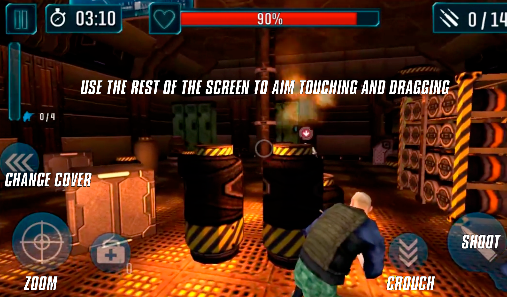
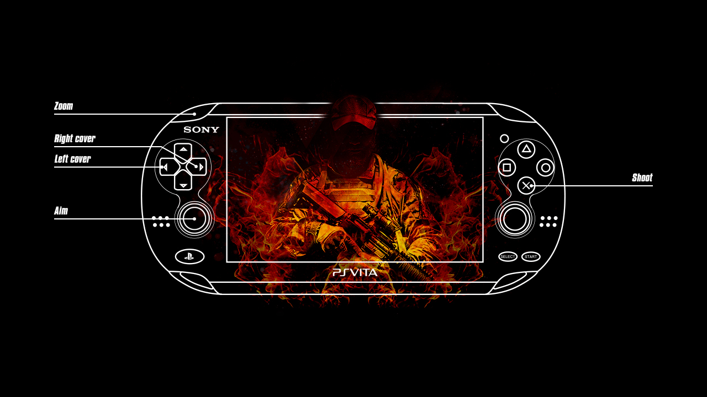

# Kill-em-All
Kill'em All Game for VitaJam2019

## The Game

Hi everyone this is the story of a man who is alone .... and .....

well you have to kill them all :-)

To do this you will have to get experience, gold, and so on. Basically win each mission. If you do this you will get money to purchase new
weapons and to improve your weapons to get access to new missions. If you don't have enough money to make the improvements then you will
have to play the farming levels. Those levels are intended to get money. You can play them as many wants you need, while the History
levels can be played just once. 

There are two types of missions, fast shooting weapons ( bullets icon ), where the enemies are closer to you, and sniper type missions ( sight icon ), where the enemies are far from you and the Telescopic Zoom is mandatory to get nice results.

## Controls

All the game is managed by touch in the screen. When you've got many components, buttons and so on is very anoyed try to use up, down, left, right, and so on to go directly where you want to go. So touch is the best option.

During the gameplay I provide both posibilites, and both of them are activated simultaneously which is great.

The first time you play you will do a very small tutorial about how to use each button on the screen. It's pretty easy to use, and you get a very good accuracy, probably better than using analog sticks. Anyway analog sticks and buttons of Vita Gamepad are available to use it.

So for your help here is the layout you can use if you decide to play using your fingers.

And this is the layout if you decide to use Vita sticks and buttons.

You can also playing combining controls. So touch for Aiming, and Zoom and Fire using Vita buttons. Choose the best one for you.

## Multilanguage Support

Even the translations are provided by using Google Translator, I can say there around 12 languages supported. So I hope you can play even in russian and other languages.

## Known Bugs

1º. In the first screen and for the first time you will be asked for your name to play. The suggested name is 'player'. You can not change it. Just press OK and go on. This issue is because there was no possible for me to provide an API call to show the native keyboard. I will do it developing a plugin for Unity, but it looks there is no native support in Unity so, sorry that feature is not enabled by the way.

2º. Even I did my best to try to finish the game at time, there was not too much time for the VitaJam2019, and even I don't own a PSVita DevKit, so sometimes memory leaks are very difficult to identify when they only happens in PSVita and not in the Editor where you're developing, in my case Unity. So because of that there is a bug that can make the game crash. I guess the origin is in a memmory leak. If that happens, just restarts the game and keep playing. The game will use the last savegame to continue in the level you are. Savegames are automatically made by the game.

## Download

You can get it from [Releases tab](https://github.com/RetroGamer74/Kill-em-All/releases).
## Credits

Me :-)

Xalgovia at Game Splash, Game Icon, Vita controls layout.

Thanks.
